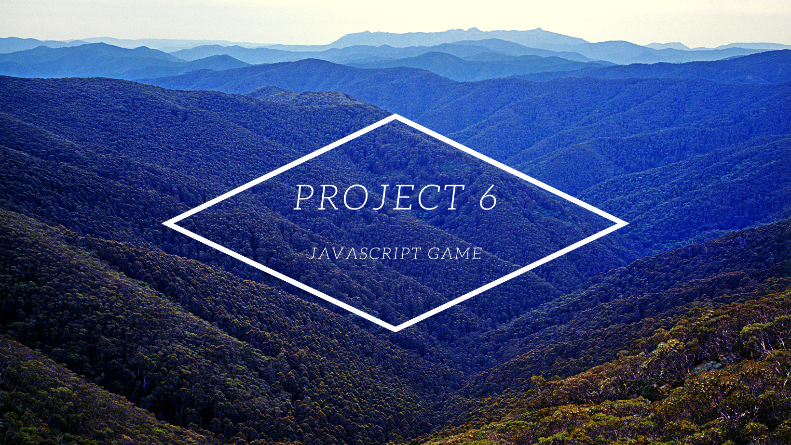
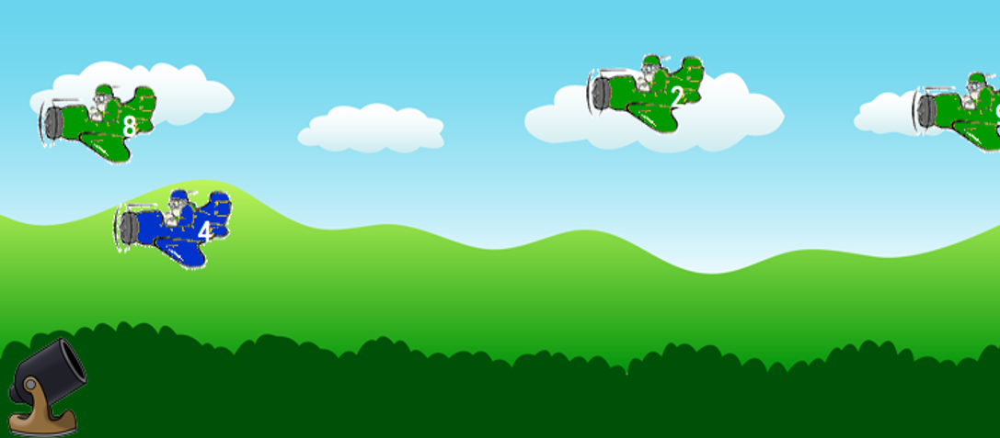

# Build Javascript Game

> (Recommended but not required)
> Approximately 3-5 days

### Code

- HTML
- CSS
- JQuery
- No HTML 5

### Description

- We get to make a game! We’re going to make an educational game to help kids learn math problems. For this game we want some simple animation of something moving and some keyboard interaction
- Following are some examples of games you can make but you are not limited to these. Feel free to come up with a different game that uses the same kind of concept

## Plane Game

> Planes fly across the screen. Shoot down planes by pressing the number on the plane. When the plane’s number is pressed, explode the plane. Have sounds as well.

## Balloon Game

> The balloons float up on the screen with numbers or math problems on them and as they float up you want to pop them by pressing the number or answer to the problem. When you press the right one, the balloon pops.

> You can also do something kinda like this http://www.youtube.com/watch?v=MhXMYw1lXY0 where they have to answer a math problem in order to jump over the hole, otherwise they fall in the hole. You can even just make it so the background moves and your guy stays in the same place.

---
